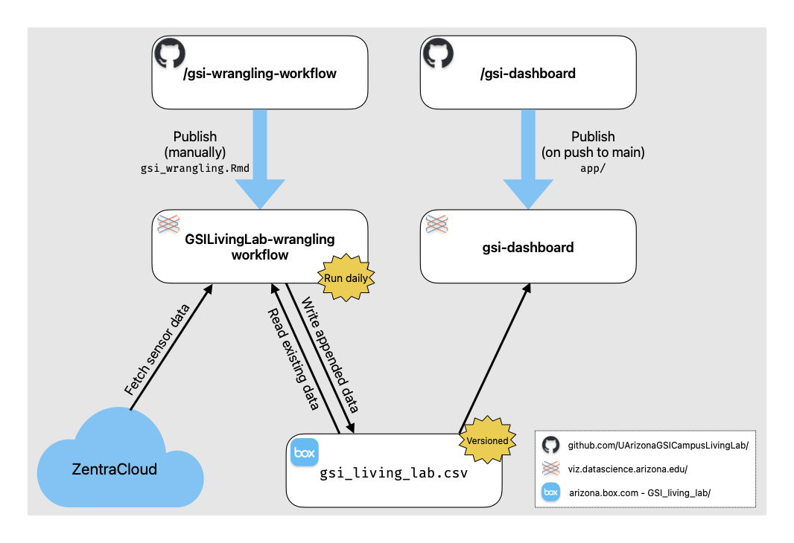

# Campus Living Lab Green Stormwater Infrastructure Dashboard

<!-- badges: start -->

  

<!-- badges: end -->

## About This Dashboard

The GSI Living Lab dashboard displays micro meteorological data for three GSI features at the University of Arizona.
Environmental variables include temperature, relative humidity, and precipitation.
Soil moisture and temperature data are also collected at each site and displayed on the dashboard.
Environmental models of plant available water, evapotranspiration, and human perceived temperature using heat index and wind chill factors.
[gsi-dashboard](https://viz.datascience.arizona.edu/gsi-dashboard/)

## How does it work?

The [gsi-wrangling-workflow](https://github.com/UArizonaGSICampusLivingLab/gsi-wrangling-workflow) repository houses `gsi_wrangling.Rmd` which is published to Posit Connect as a scheduled workflow running daily at noon.
This .Rmd file contains code to pull the most recent data for the Campus Living Lab sites from [ZentraCloud](https://zentracloud.com/), wrangle the data, and append it to a .csv file stored on Box.
The gsi-dashboard repository (this one) contains code for a [Shiny](https://shiny.posit.co/) app that is automatically deployed to Posit Connect (using GitHub Actions) when updates are made to the main branch.
This Shiny app reads in the data from Box on start-up and provides interactive visualizations of the data.

## Contributing

To get this app working locally, you will need to create a .Renviron file with the environment variable `BOX_TOKEN_TEXT` with the contents of a authorization token for a the Box service app used to read data in from Box.

To contribute to this project, please create a new branch for your changes and make a pull request.
One easy way to do this from within R is with the `usethis` package and the `pr_*` functions.
`pr_init("branch-name")` begins a new branch locally, `pr_push()` helps you create a new pull request, and after it is merged you can use `pr_finish()` to clean things up.
More about this workflow [here](https://usethis.r-lib.org/articles/pr-functions.html).

### `renv`

This project uses [`renv`](https://rstudio.github.io/renv/articles/renv.html) for package management.
When opening this repo as an RStudio Project for the first time, `renv` should automatically install itself and prompt you to run `renv::restore()` to install all package dependencies.

### Shiny app structure

The content and layout of the dashboard is defined in `app/app.R`.
Custom functions used (e.g. to create plots) follow the form `gsi_*()` and are defined in scripts in the `app/R/` directory.

To learn more about Shiny and the `bslib` package (used to define the UI of the dashboard), see these resources:

-   [Welcome to Shiny](https://shiny.posit.co/r/getstarted/shiny-basics/lesson1/index.html)
-   [Mastering Shiny](https://mastering-shiny.org/)
-   [`bslib`](https://rstudio.github.io/bslib/index.html)

### Modifying plot theme

The theme for all of the `ggplot2` plots in the dashboard is controlled by `R/0-theme_gsi.R`.
(the filename starts with '0' because the files are sourced alphabetically and the theme is used by all the other functions in `R/`).

## Deployment

This app is published to <https://viz.datascience.arizona.edu/gsi-dashboard/> automatically by a GitHub action whenever changes are made to the main branch of this repository.
If changes are not being reflected on the deployed app or there are other issues with the live app, please contact \@cct-datascience.
