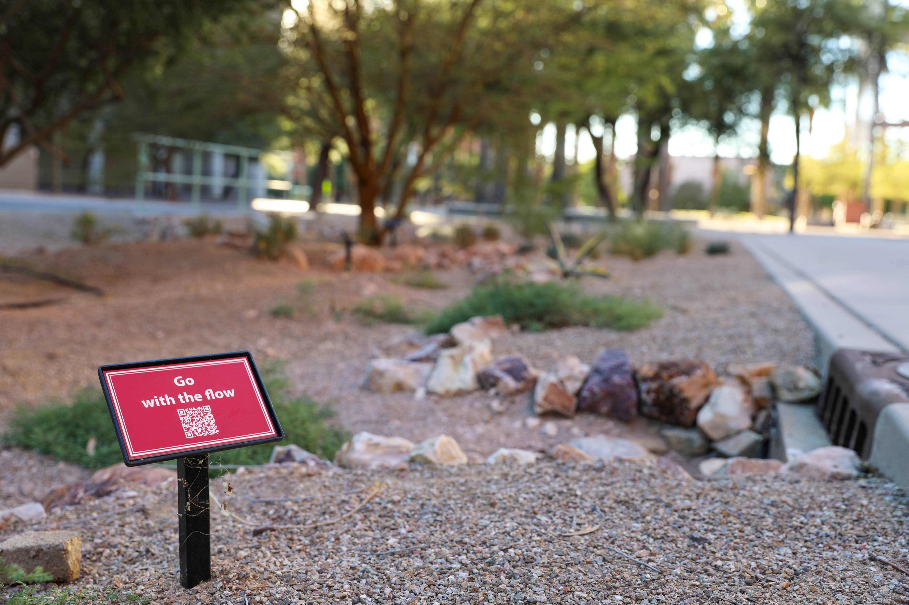

```{=html}
<!--# Campus Living Lab {style="text-align: center;"}

## Green Storm Water Infrastructure Project {style="text-align: center;"}-->
```
Welcome to the dashboard for the University of Arizona [Campus Living Lab](http://gicampuslivinglab.arizona.edu/) for green stormwater infrastructure.

This innovative campus initiative was designed to transform our green stormwater infrastructure (GSI) features located across campus into an interactive learning environment for students, researchers, and partners from various disciplines.

-0185.jpg){style="display:block;margin:0 auto" width="662"}

### Chase the Rain {style="text-align: center;"}

Visit our three sites on campus: Old Main, Gould Simpson, and Physics and Atmospheric Sciences. These sites represent various green stormwater infrastructure designs to capture and water plants. Old Main represents a native xeroscape rain garden with the primary water source being rooftop runoff. Gould Simpson is a Resilience Garden sponsored by the University of Arizona Arboretum featuring legume trees that receives water from two rooftops and surrounding hardscapes. Physics and Atmospheric Sciences features a classic southwest landscape, slight grading for stormwater collection, and desert vegetation. For more information, visit the [Campus Living Lab](http://gicampuslivinglab.arizona.edu/) website.

### Go With the Flow {style="text-align: center;"}

In the Atmosphere tab you'll find figures for:

-   Air Temperature
-   Precipitation
-   Percent Relative Humidity

In the Soil tab you'll find figures for soil properties at two depths:

-   Soil Temperature
-   Soil Moisture
-   Matric Potential (*only at Gould Simpson and Old Main sites*)

In the Environmental Plots tab you'll find figures for:

-   Evapotranspiration

    -   This is calculated daily using the [Penman-Monteith](https://en.wikipedia.org/wiki/Penman--Monteith_equation) method"

-   Plant Available Water

    -   Uses the equation from [Metergroup](https://metergroup.com/measurement-insights/how-to%5D(https://metergroup.com/measurement-insights/how-to-)%20model-plant-available-water/) with estimated values for field capacity and plant wilting point from sandy-loam soil texture.

-   Perceived Temperature

    -   This is calculated from National Weather Service [wind chill](https://www.weather.gov/media/epz/wxcalc/windChill.pdf) or [heat index](https://www.wpc.ncep.noaa.gov/html/heatindex_equation.shtml) equations.

{style="display:block;margin:0 auto" width="665"}
